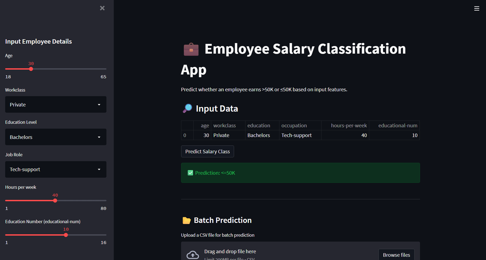

# Employee Salary Prediction [](https://colab.research.google.com/github/JeetMajumdar2003/Employee-Salary-Prediction/blob/main/Employee_Salary_Prediction.ipynb)

This project predicts whether an employee earns more than \$50K per year using demographic and work-related features. It demonstrates a complete machine learning workflow, from data exploration to deployment via a Streamlit web app.


## Table of Contents

- [Overview](#overview)
- [Features](#features)
- [Project Structure](#project-structure)
- [Setup Instructions](#setup-instructions)
- [Usage](#usage)
- [Model Details](#model-details)
- [Streamlit App](#streamlit-app)
- [License](#license)

## Overview

The goal is to classify employees into two salary classes (`>50K` or `<=50K`) based on features such as age, education, occupation, and more. The workflow includes data cleaning, preprocessing, feature engineering, model training, evaluation, and deployment.


## Features

- Data cleaning and preprocessing
- Feature selection using Random Forest importance
- Model training (Logistic Regression, Decision Tree, Random Forest, Gradient Boosting)
- Model evaluation and comparison
- Saving the best model pipeline
- Interactive Streamlit app for single and batch predictions

## Project Structure

```
.
├── Employee_Salary_Prediction.ipynb   # Main notebook with ML workflow
├── app.py                             # Streamlit app for predictions
├── salary_pipeline_streamlit.pkl      # Saved ML pipeline for deployment
├── adult_3.csv                        # Dataset (not included here)
└── README.md                          # Project documentation
```

## Setup Instructions

1. **Clone the repository**  
   ```
   git clone <repo-url>
   cd "Employee Salary Prediction"
   ```

2. **Install dependencies**  
   It is recommended to use a virtual environment.
   ```
   pip install -r requirements.txt
   ```
   Or manually install:
   ```
   pip install pandas numpy scikit-learn streamlit joblib matplotlib
   ```

## Usage

### Running the Streamlit App

To run the Streamlit app, execute the following command in your terminal:

```bash
streamlit run app.py
```

This will launch the app in your default web browser. You can enter employee details in the sidebar to get a salary class prediction, or upload a CSV for batch predictions.

#### Batch Prediction

To predict salary classes for multiple employees at once:

1. Prepare a CSV file with the following columns (matching the training features):
   - `age`, `workclass`, `education`, `occupation`, `hours-per-week`, `educational-num`
2. Use the "Batch Prediction" section in the app to upload your CSV.
3. Download the results with predicted classes.

## Model Details

- **Features Used:**
  - Only the most important features (selected via Random Forest feature importance):
    - `age`, `workclass`, `education`, `occupation`, `hours-per-week`, `educational-num`
- **Preprocessing:**
  - Handles missing values, encodes categorical variables, and scales numerical features
- **Model Selection:**
  - Compared Logistic Regression, Decision Tree, Random Forest, Gradient Boosting
  - Selected the best model (Gradient Boosting) based on accuracy and F1-score
- **Deployment:**
  - The final pipeline (preprocessing + scaler + model) is saved as `salary_pipeline_streamlit.pkl`
- **Model Performance:**
  - The model achieved an accuracy of 85.5% and an F1-score of 0.67.

## Streamlit App

The Streamlit app provides:

- **Single Prediction:**
  - Enter employee details in the sidebar and click "Predict Salary Class" for an instant prediction.
  - 
- **Batch Prediction:**
  - Upload a CSV file (with the required columns in the correct order) for batch predictions.
  - Download the results as a CSV with predicted classes.
  - 
- **User-Friendly UI:**
  - Clean, interactive interface for both individual and batch use cases.
  - Preview of uploaded data and predictions.

> **Note:** The app requires `salary_pipeline_streamlit.pkl` to be present in the project directory.

## License

This project is licensed under the MIT License.

---

> *Project completed under IBM internship program taught by Edunet Foundation through AICTE.*